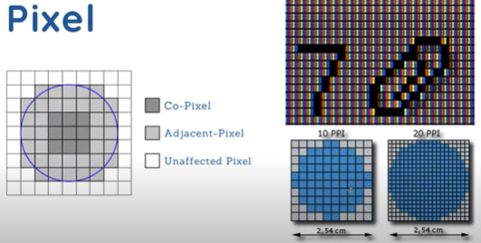
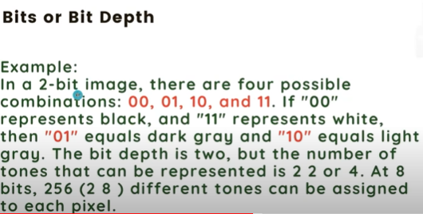
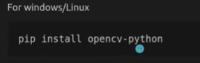
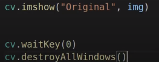
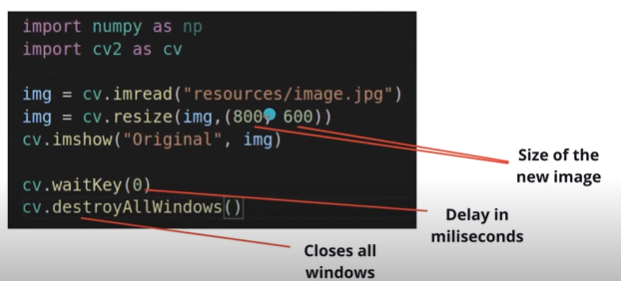
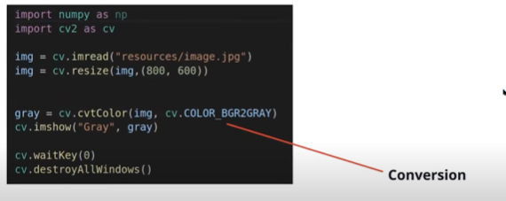
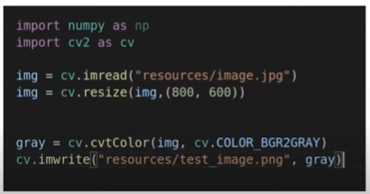

# **The basics of Computer Vision**
## **Writen by:** Aarish Khan
## **Date:** 3 January 2023

> # **Pixels: What are they and their types:**

* In computer vision, pixels are the smallest units of an image. Each pixel represents a single point in the image and contains information about its color and intensity. 

* The types of pixels in computer vision can be categorized based on the color representation and the depth of information they carry. Here are some common types of pixels:

> **Binary Pixels (1-bit):**

* Binary pixels are the simplest type, representing only two values - typically black and white, or on and off.

* They are commonly used in binary images for tasks like object detection and basic image processing.

> **Grayscale Pixels (8-bit or 16-bit):**

* Grayscale pixels have a single channel representing intensity or brightness.
They use varying shades of gray to represent different levels of intensity, where 0 is black, and the maximum value (e.g., 255 for 8-bit) is white.

* Grayscale images are often used in simpler applications and algorithms.

> **RGB Pixels (24-bit or 48-bit):**

* RGB pixels represent color using the Red, Green, and Blue color channels.

* RGB is the most common color representation in images and is widely used in computer vision applications. These are some examples of pixels however, there are plenty of them.

> # **Examples of bit and bit depths:**

* In computer vision, bits and bit depths play a crucial role in representing and processing visual information. Here's an overview of bits and bit depths in the context of computer vision:

> **Bits:**

* A bit (short for binary digit) is the most basic unit of digital information, representing a binary value of 0 or 1.

* In computer vision, bits are used to represent the intensity or color of pixels in an image. The number of bits determines the range of values that can be assigned to each pixel.

> **Bit Depth:**

* Bit depth refers to the number of bits used to represent the color or intensity of each pixel in an image.

* Common bit depths include 1-bit (binary), 8-bit (grayscale), 24-bit (RGB), and 32-bit (RGBA).
The higher the bit depth, the more information each pixel can store, allowing for a wider range of colors or intensity levels.

> **Grayscale Images:**

* In grayscale images, each pixel is represented by a single channel, typically using 8 bits.

* An 8-bit grayscale image can represent 2^8 (256) different intensity levels, ranging from 0 (black) to 255 (white).

> **Color Images (RGB):**

* In color images using the RGB model, each pixel is represented by three channels: Red, Green, and Blue.

* An 8-bit per channel RGB image has a total bit depth of 24 bits (8 bits/channel * 3 channels), allowing for 2^24 (about 16.8 million) different colors.

> **Impact on Image Quality:**

* Higher bit depths generally result in better image quality and more accurate color representation.

* However, higher bit depths also lead to larger file sizes and increased computational requirements.

> # **Image Formats and File Types:**

* The most common formats for storing grayscale images are BMP, JPEG, GIF, TIFF, and PNG.

These different formats have varying levels of compression and support

* The most common formats for storing grayscale images are BMP, GIF, JPEG, and PNG.

* JPEG is commonly used for photographs due to its lossy compression technique, which reduces file size but can degrade the image's quality.

> What is JPEG commonly used for?

* JPEG is commonly used for photographs due to its lossy compression technique, which reduces file size while maintaining acceptable image quality. 

> # **Tones in an Image:**

> What are Tones, Intro?
* Tones in an image refer to variations in brightness or color intensity across different areas of the image. 

* Understanding and analyzing tones are essential for various computer vision tasks, including image processing, object recognition, and scene understanding.

*  Here are some key aspects related to tones in an image:

> **Brightness and Contrast:**

* Tones are closely related to the brightness levels in an image. Bright areas have higher tones, while dark areas have lower tones.

* Contrast represents the difference in tones between different parts of an image.

* High contrast indicates a significant difference between bright and dark regions.

> **Gray Tones (Grayscale Images):**

* In grayscale images, tones are represented by different shades of gray, ranging from black to white. Each pixel in the image corresponds to a specific tone or intensity level.

* Grayscale images are commonly used in computer vision for simplicity and efficiency in certain applications.

> **Color Tones (Color Images):**

* In color images, tones are associated with variations in color intensity across different channels (e.g., Red, Green, and Blue in RGB color space).

* Analyzing color tones allows computer vision systems to identify objects, textures, and patterns based on their distinctive color characteristics.

> # **OpenCV library in Python with Computer Vision**

> Intro to OpenCV

* OpenCV (Open Source Computer Vision Library) is an open-source computer vision and machine learning software library. 

* It provides a wide range of tools and functionalities that are used in various computer vision applications. 

* Here are some key aspects of the OpenCV library:

> **Overview:**

* OpenCV was initially developed by Intel and later maintained by the OpenCV community.

* It is written in C++ and has interfaces for C, Python, and Java, making it accessible to a broad audience of developers.

> **Functionality:**

* OpenCV offers a comprehensive set of functions for image and video processing, feature extraction, object detection, machine learning, and more.

* It supports a variety of image and video formats, making it versatile for handling different types of visual data.

> **Image Processing:**

* OpenCV includes a multitude of functions for basic and advanced image processing tasks, such as filtering, morphology, color space conversions, and histogram analysis.

* It provides tools for image enhancement, manipulation, and transformation

> **Cross-Platform and Open Source:**

* OpenCV is cross-platform, making it compatible with various operating systems, including Windows, Linux, macOS, and mobile platforms like Android and iOS.

* Being open source, developers can access and contribute to the source code, fostering a collaborative development environment.

> **Note**

To use OpenCV in a project, you typically need to install the library and its dependencies, after which you can leverage its powerful features in your applications for tasks related to computer vision and image processing.

> # **Using OpenCV in a project**

### Step 1: Installation

* To install opencv using pip (Python package installer), run this command on your terminal or cmd

### Step 2: Import neccessary libraries and read Image

* you will need to import your libraries and import your image. Below, we have create a variable named img. You can use the "cv.imread" function to read your image.

### Step 3: Display image

* In the above code snippet, we have imported necessary libraries from cv2 module and then loaded
an image into an array called "image". 

* The imshow() function is used to display this image.

### Step 4: Resizing the image

* In the given code snippet, we are resizing the image by passing the name of the image
and dimensions(width,height) as arguments to the resize() function. 

* This returns a new image which is stored in "resized" variable. Then we displayed this new image using imshow().

### Step 5: Convert to Grayscale

* The image above shows us how We can convert color images to gray scale images using the cvtColor() function.

* In gray scale conversion, we just need to pass our colored image to the cv2.cv

### Step 6: Saving the image

* In the last step, we save the processed image using the imwrite() method.

* Save the processed image using the imwrite() method. It takes two parameters - name of
the image and image itself to save.

> So there you have it, there's how you can use the OpenCV library in a Project!

